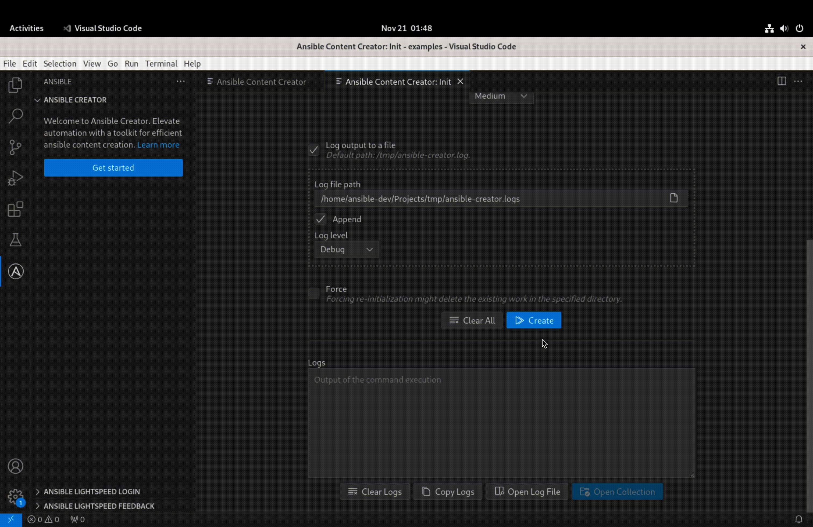
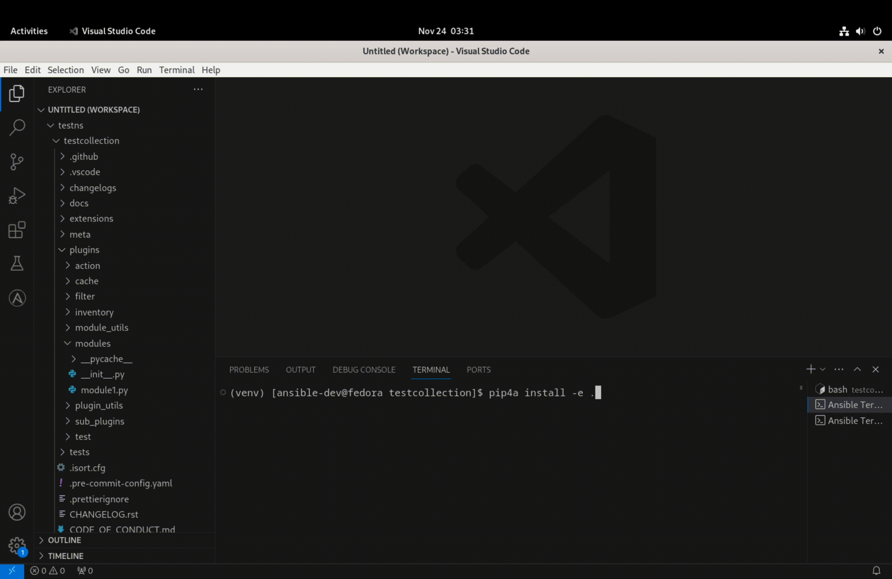
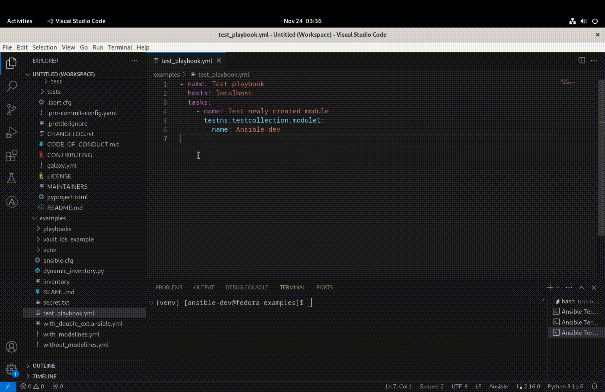

# Building Ansible Collection using using Ansible Development Tools (ADT)

This guide illustrates a comprehensive Ansible development workflow that showcases the integration of various tools within the Ansible ecosystem to create an Ansible collection. The tools featured in this workflow include:

- [ansible-creator](https://github.com/ansible/ansible-creator)
- [ansible-dev-environment](https://github.com/ansible/ansible-dev-environment)
- [ansible-lint](https://github.com/ansible/ansible-lint)
- [ansible-navigator](https://github.com/ansible/ansible-navigator)
- [VS Code Ansible extension](https://github.com/ansible/vscode-ansible)

## Step 1: Scaffolding collection using ansible-creator

- Open VS Code and click the Ansible icon in the activity bar to access Ansible Creator section. Click "Get Started" under that section to open the menu page of Ansible Creator in VS Code.

- Check system requirements and install ansible-creator if needed. Ensure all requirements in the `system requirements` box have green ticks.


- Click **Initialize a collection** to open the **Init** interface. Fill in the form with the collection name, initialization path, verbosity, and logging options.

- Click **Create** to scaffold the collection in the desired location. You have the option to review the logs or open the log file in VS Code editor for details.

- Click the **Open collection** button to add the collection folder to the workspace.



NOTE: For a more detailed explanation about using Ansible Creator in the VS Code Ansible Extension, refer to [doc: ansible-creator].

## Step 2: Installing your collection using ansible-development-environment (ade)

- With the initial collection structure in place, use 'ansible-dev-environment' (ade) to install the newly created collection in editable mode, similar to Python modules.

- Navigate to the collection directory and run the following command:

```console
$ pip4a install -e .
```

- This installation method adds the collection in the system paths, enabling Ansible to recognize it. Additionally, it improves the development process by allowing on-the-go changes to the module code.

- You can check if the collection is installed or not by using `ansible-galaxy` command. Run the following command in a terminal to list installed collections. Your newly created collection will appear in the list.

```console
$ ansible-galaxy collection list
```



## Step 3: Add python code to bring the collection to life

- Navigate to the collection directory and navigate to `plugins/modules/`. Create a [module-name].py file and add documentation, examples and logic to the module.

- Because you installed using pip4a, you can change module code dynamically and observe the effects during playbook execution.

NOTE: For more information about module development, refer to the [Developing modules](https://docs.ansible.com/ansible/latest/dev_guide/developing_modules_general.html) section of the Ansible Developer Guide.

## Step 4: Using ansible-lint to check module syntax in the playbook

- Leverage vscode-ansible extension and `ansible-lint` to gain insights into the collection without running the playbook

- Create a simple playbook under the `playbooks` directory.

- When you have completed writing the playbook that uses the newly collection module, saving the file will automatically run `ansible-lint` on the playbook.

- With its integration in the extension, ansible-lint can detect mistakes, such as incorrect option values and missing required options, along with other rules for ansible best practices by providing feedback in the editor (red and yellow squiggly lines) and it the `Problems` tab in the vscode.


## Step 5: Using ansible-navigator to run the playbook with the collection module

- The Ansible extension in VS Code can detect the playbook files and provide several ansible related options for it. One option is to run the playbook without having to leave the editor.

- Right-click on the opened playbook in the editor and choose `Run Ansible Playbook via`. This provides options to run the playbook via ansible-navigator or ansible-playbook.

- Select `Run playbook via ansible-navigator run` to execute the playbook in the terminal within VS Code.



## Step 6: Adapting to changes in the module code

- This is a good time to experiment with the power of `installing collection in editable mode`. Make changes in the module code by adding new functionality and/or modifying the existing functionalities.

- Repeat `steps 4 and 5` to observe how the extension and ansible-lint seamlessly adapt to the changes.

- The Ansible extension along with ansible-lint continues to provide linting functionalities for the updated module. Running the playbook using ansible-navigator incorporates the new module code seamlessly.

This unified development suite, incorporating ansible-creator, ansible-development-environment (ade), ansible-lint, ansible-navigator, and vscode-ansible extension, provides content developers with an enhanced and efficient method for their Ansible development workflow.

The integration of these tools streamlines the development process, offering a cohesive experience for building Ansible Collections.
